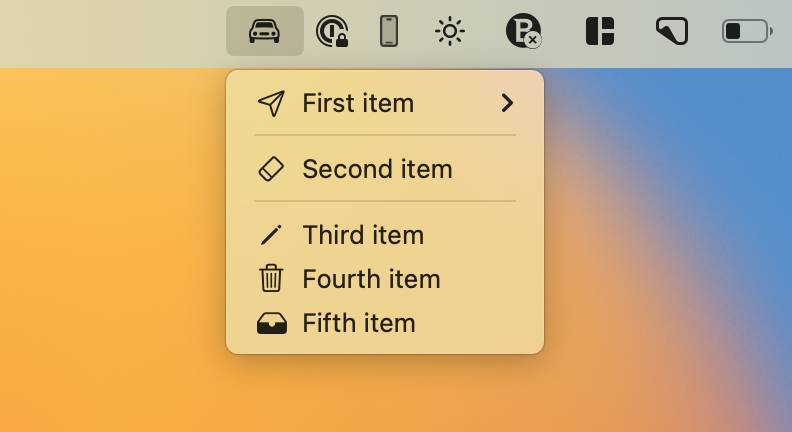

# react-native-menubar-extra

Easily add native menubar (`NSMenu`) to your React Native MacOS App.

<p align="center">
  
</p>

> [!WARNING]
> This library supports only [react-native-macos](https://github.com/microsoft/react-native-macos#readme)

## Installation

```sh
yarn add react-native-menubar-extra
# or ---
npm install react-native-menubar-extra
```

```sh
cd macos && pod install
```

## Usage

```tsx
import { MenuBarExtraItem, MenubarExtraView } from 'react-native-menubar-extra';

const MenuBar = () => {
  return (
    <MenubarExtraView icon="car">
      <MenuBarExtraItem
        title="Item 1"
        onItemPress={() => {
          console.log('Item pressed');
        }}
      />
    </MenubarExtraView>
  );
};
```

For more advanced example check out the [example](https://github.com/okwasniewski/react-native-menubar-extra/tree/main/example) folder.

## Reference

### `MenuBarExtraView`

Container view that sets up root menu.

| Prop   | Description                                                                                                   |
| ------ | ------------------------------------------------------------------------------------------------------------- |
| `icon` | Name of [SF Symbol](https://developer.apple.com/sf-symbols/) as string that will appear in system status bar. |

**Important**: Don't pass other types of components as children as it will break the indexing in the menu.

### `MenuBarExtraItem`

| Prop          | Description                                                                                                        |
| ------------- | ------------------------------------------------------------------------------------------------------------------ |
| `title`       | The menu item's title                                                                                              |
| `icon`        | Name of [SF Symbol](https://developer.apple.com/sf-symbols/) as string that will be rendered next to item's title. |
| `onItemClick` | Callback that will be called after clicking on menu item.                                                          |

### `MenuBarExtraSeparator`

Separator displayed between items. Needs to have at least one item above and below.

## Contributing

See the [contributing guide](CONTRIBUTING.md) to learn how to contribute to the repository and the development workflow.

## License

MIT

---

Made with [create-react-native-library](https://github.com/callstack/react-native-builder-bob)
